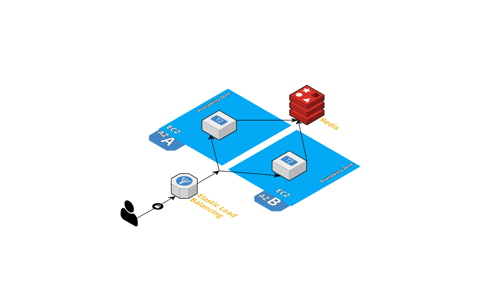

# flask hello-api with Terraform and Ansible

## Goal
The goal is to setup a PoC with simple API rest writen in Flask and deploy the infraestructure using Docker, Terraform and for the configuration management and app deployment use Ansible.

## How it works
### The application
The application (app.py) is a simple REST API written in flask that accepts a name and a date of birth and replies.

### The infrastructure


The Terraform will create a simple web tier infrastructure with two instance with public IP's, a Redis instance using Elasticache and a Load balancer (ELB).

This is a simple infrastructure to show how you can use Terraform and Ansible for app deployment.

For a more elaborate scenario that uses the concept of immutable deployment using AWS and Terraform with CI please check my example using [Immutable deployments](https://github.com/ember/testing-express-api).


### The deployment
The application is packaged using a docker container. So the setup of the instances and the deployment of the application is done with Ansible.

As this requires no-downtime the Ansible also removes and re-adds the instances from the ELB so you can do a rolling upgrade without taking all the instance off the load balancer.

## How to run
This assumes that you have an AWS IAM user with API access and have installed Docker Ansible and Terraform.

All the complexity is masked with a Makefile.

## Run all the stack
To create all the containers, ift and run the ansible you first need to setup the environment variables
```bash
export DOCKER_USER=someuser
export DOCKER_PASSWORD=somepassword
export AWS_ACCESS_KEY_ID=aws_key
export AWS_SECRET_ACCESS_KEY=aws_secret
make create-all
```
### Run locally
To try the app with redis locally you can run
```bash
make run-local
```

This will run the compose file with the application and a redis instance running in a container.

### Test API locally
You can populate and try the API by running
```bash
make test ELB_ENDPOINT=http://localhost

{
  "message": "Date is incorrect, should be YYYY-MM-DD"
}
{
  "message": "Hello, John! Happy birthday"
}
{
  "message": "Hello, Mary! Your birthday is in 5 days"
}
{
  "message": "2001-03-11"
}
{"message": "Person Harry doesn't exist"}
```

### Build the container and push it
For container image exists the Docker Hub public registry but it can also be easily change to use a private registry.

To build the image
```bash
make build-docker
````

To build and publish the image will require that you have the env vars for your registry set up.
```bash
export DOCKER_USER=someuser
export DOCKER_PASSWORD=somepassword
make publish-docker
```

This also accepts publishing tags
```bash
make publish-docker APP_VERSION=2
```

## Deploy the infrastructure
This will use Terraform to deploy the initial infraesctruture. Terraform will set the VPC, Public subnets, Instance, Redis instance and the two instances in eu-wes-t1.

The cost in AWS using a mix of free tiers is about $49.18 / month.

### Run Terraform
To run the Terraform you will need to hae the env vars for your credentials.
```bash
export AWS_ACCESS_KEY_ID=aws_key
export AWS_SECRET_ACCESS_KEY=aws_secret
make infra
```

To see the ELB that was created you can run
```bash
cd terraform && terraform output elb_address
```

## Deploy hello-api
For the deployment of the application we are going to use Ansible.
Ansible will use a dynamic inventory from AWS to get the instances tagged with hello-api and it will install and configure Docker and also deploy our application.

For the Ansible you also need the AWS env vars.
```bash
export AWS_ACCESS_KEY_ID=aws_key
export AWS_SECRET_ACCESS_KEY=aws_secret
make deploy
```

To deploy specific versions of the application and assuming you already publish the new tag into the Docker Registry you can:

```bash
make deploy APP_VERSION=2
```

Ansible will remove the instance from the ELB, configure the new deployment version, validate that the container is accepting requests and re-add to the ELB.

To test that everything is working you can populate the Redis
```bash
make test
```

After all is working you can destroy all infrastructure with
```bash
make destroy
```